# ベンダーMTG・紹介案件管理ツール 設計提案（確認用）

作成日: 2026-10-06 ／ ステータス: 確認待ち（実装未着手）

---

## 1. 技術スタック（推奨）

| 領域 | 採用案 | 理由 |
|---|---|---|
| フレームワーク | **Next.js 15（App Router）+ TypeScript** | 画面・API・cron を1プロセスにまとめられる。少人数なら十分 |
| UI | **Tailwind CSS**（装飾なし、テーブル中心） | 参考サイトの業務的な雰囲気に合わせやすい。レスポンシブが楽 |
| DB / ORM | **PostgreSQL + Prisma** | 履歴・集計・ユニーク制約を素直に書ける。Railway の Postgres をそのまま使える |
| 認証 | **Auth.js v5（Credentials）+ bcrypt**、JWT セッション Cookie | 管理者がアカウント発行する方式に合う。`role` をセッションに持たせ、**全 Server Action / Route Handler で再チェック** |
| ホスティング | **Railway**（Web サービス1つ + Postgres1つ） | 参考サイトと同じ基盤。常駐プロセスなので cron を中で回せる。月 $5〜10 程度 |
| cron | **アプリ内 node-cron（5分ごと）** + `POST /api/cron/run`（`CRON_SECRET` 保護） | 1時間前リマインドに 5 分間隔が必要。外部 cron（Railway Cron / GitHub Actions）からも叩ける逃げ道を用意 |
| LINE | **@line/bot-sdk**：push API で送信、Webhook で連携コード受信（署名検証） | 要件どおり |
| CSV | papaparse + encoding-japanese（Shift_JIS 自動判定） | 日本の CSV は SJIS が多い |
| カンバン | クリックでステータス変更 + ドラッグ（@hello-pangea/dnd） | スマホはクリック操作を主にする |
| カレンダー | 自作の月/週グリッド | ライブラリ不要。MTG と面談を色分け表示 |

### 不採用にした案
- **Vercel + Neon**：Hobby プランの cron が 1 日 1 回のみで「1時間前」通知が不可。Pro（$20/月）なら可。
- **Supabase（Auth + RLS）**：ロール制御を RLS で書くと複雑化。今回はサーバー側で一元チェックする方が追いやすい。
- **SQLite（ApoBoost 方式）**：ホスティング時に永続ボリュームと単一インスタンス前提になるため、Postgres の方が運用が楽。

### ローカル開発
- Node.js 24 はインストール済み。Docker / Postgres は未インストール。
- 候補：A) `brew install postgresql@16`（推奨・無料） B) Railway 上に開発用 Postgres を1つ作る C) Neon 無料枠

---

## 2. DB 設計（ER 図）

```mermaid
erDiagram
  User ||--o{ VendorMeeting : "商談担当者"
  User ||--o{ Notification : "受信"
  User ||--o{ StatusHistory : "変更者"
  User ||--o{ MonthlyGoal : "担当者別目標(任意)"
  Vendor ||--o{ VendorMeeting : ""
  Vendor ||--o{ Referral : ""
  Contact ||--o{ Referral : "紹介先"
  Contact ||--o{ ContactTag : ""
  Tag ||--o{ ContactTag : ""

  User {
    int id PK
    string loginId UK
    string name
    string passwordHash
    enum role "ADMIN | SALES"
    string lineUserId "null可"
    string lineLinkCode "連携用ワンタイムコード"
    datetime lineLinkCodeExpiresAt
    boolean mustChangePassword
    boolean isActive
    datetime createdAt
  }

  Vendor {
    int id PK
    string name "社名"
    string contactName
    string contactEmail
    string contactPhone
    string serviceSummary
    int referralFee "紹介報酬単価(円)"
    string saleshubUrl
    enum meetingStatus "NOT_DONE | DONE"
    boolean meetingStatusManual "手動上書きフラグ"
    string memo
    boolean isActive
    datetime createdAt
  }

  VendorMeeting {
    int id PK
    int vendorId FK
    int assigneeId FK "商談担当者"
    datetime scheduledAt
    enum format "ONLINE | VISIT"
    string meetingUrlOrPlace
    enum approvalStatus "PENDING | APPROVED | REJECTED"
    string rejectReason
    enum executionStatus "SCHEDULING | CONFIRMED | DONE | RESCHEDULE | CANCELLED"
    string minutes "議事メモ"
    string nextAction
    date nextActionDue
    datetime doneAt
    datetime createdAt
  }

  Contact {
    int id PK
    string name
    string company
    string title "役職"
    string industry
    string employeeSize
    string region
    string email
    string phone
    string otherContact
    boolean isOnSaleshub
    string relationMemo
    boolean isActive
    datetime createdAt
  }

  Tag {
    int id PK
    string name UK
  }

  ContactTag {
    int contactId FK
    int tagId FK
  }

  Referral {
    int id PK
    int vendorId FK
    int contactId FK
    date pickedUpAt
    enum status "RECEIVED | CONTACTING | SCHEDULING | MEETING_CONFIRMED | MEETING_DONE | DECLINED"
    datetime statusChangedAt "停滞判定用"
    datetime meetingAt
    enum meetingFormat "ONLINE | VISIT | null"
    string meetingUrlOrPlace
    string meetingResult
    string nextAction
    date nextActionDue
    int rewardAmount "単価から自動入力・変更可"
    enum rewardStatus "UNFIXED | APPLIED | APPROVED | INVOICED | PAID"
    datetime rewardApprovedAt "計上ベース集計用"
    date invoicedAt
    date paymentDueAt
    date paidAt
    boolean forceUnlocked "MTG未実施ブロックの強制解除"
    string forceUnlockReason
    datetime createdAt
  }

  StatusHistory {
    int id PK
    enum entityType "VENDOR_MEETING | REFERRAL | VENDOR"
    int entityId
    string field "approvalStatus / executionStatus / status / rewardStatus ..."
    string fromValue
    string toValue
    string note "差し戻し理由・強制解除理由など"
    int changedById FK
    datetime changedAt
  }

  Notification {
    int id PK
    int userId FK
    string type "MEETING_1DAY | MEETING_1HOUR | MINUTES_MISSING | DUE_TODAY | OVERDUE | APPROVAL_PENDING | REJECTED | STAGNANT | PAYMENT_LATE"
    string title
    string body
    string linkUrl
    string dedupeKey UK "同じ通知を二重送信しない"
    datetime readAt
    datetime lineSentAt
    string lineError
    datetime createdAt
  }

  MonthlyGoal {
    int id PK
    string yearMonth "2026-10"
    int userId FK "null=全体"
    int meetingTarget "ベンダーMTG件数"
    int referralTarget "紹介件数(全体のみ)"
    int rewardAccrualTarget "報酬・計上ベース(円)"
    int rewardPaidTarget "報酬・入金ベース(円)"
  }

  Setting {
    string key PK "stagnationDays / dailyDigestHour / lineEnabled.* ..."
    string value
  }
```



補足
- 重複紹介（同じ Vendor × Contact）はユニーク制約にせず、登録時に**警告して続行可**とする（見送り後の再紹介があり得るため）。
- `Notification.dedupeKey` 例：`meeting:12:1h`、`referral:34:stagnant:2026-10-13`。cron が何度走っても同じ通知は 1 回だけ。
- ステータス変更はすべてサービス層の `changeStatus()` を通し、必ず `StatusHistory` を書く。

---

## 3. 画面一覧

| # | 画面 | パス | 管理者 | 商談担当者 | 主な内容 |
|---|---|---|---|---|---|
| 1 | ログイン | `/login` | ○ | ○ | ID / パスワード。初回ログイン時はパスワード変更を強制 |
| 2 | ダッシュボード | `/` | ○ | ○(自分のMTGのみ) | 今日の予定、期限切れタスク、承認待ち件数、今月の目標達成率バー、「今日やること」 |
| 3 | ベンダー一覧 / 詳細 | `/vendors`, `/vendors/[id]` | ○ | ○(閲覧、単価は非表示) | 詳細にそのベンダーの MTG 一覧・紹介案件一覧（紹介案件は管理者のみ） |
| 4 | ベンダーMTG | `/meetings`（カンバン/リスト）, `/meetings/calendar` | ○ | ○(自分の分) | 登録・承認申請・実施ステータス・議事メモ・次アクション |
| 5 | 紹介案件 | `/referrals`（カンバン/リスト）, `/referrals/[id]` | ○ | × | ベンダー・ステータス・担当で絞込。MTG未実施ブロックと強制解除 |
| 6 | 繋がりリスト | `/contacts`, `/contacts/import`, `/contacts/[id]` | ○ | × | 検索・絞込・CSV 取込（列マッピング・重複チェック）・紹介履歴 |
| 7 | 報酬管理 | `/rewards` | ○ | × | ステータス別一覧、月次集計（計上/入金）、CSV 出力 |
| 8 | 承認キュー | `/approvals` | ○ | × | MTG 承認待ち・報酬計上申請を一括処理（承認／差し戻し＋理由） |
| 9 | 目標設定 | `/goals` | ○ | × | 月 × 担当者で目標入力 |
| 10 | 設定 | `/settings/users`, `/settings/line`, `/settings/thresholds` | ○ | △(自分のLINE連携のみ) | ユーザー管理、LINE 連携コード発行、停滞日数・通知時刻・通知種別 ON/OFF |
| – | 通知一覧 | `/notifications` | ○ | ○ | ヘッダーのベルから。既読管理 |

共通：全画面日本語、スマホ幅ではサイドバーをドロワー化、一覧はカード表示に切替。

---

## 4. 業務ルールの実装方針

- **MTG 未実施ブロック**：Referral を `CONTACTING` 以降へ変更する際、Vendor.meetingStatus が `DONE` でなければ拒否。管理者のみ `forceUnlocked=true`（理由必須）で解除。履歴に残す。
- **重複紹介警告**：同じ vendorId × contactId の Referral が存在すれば警告ダイアログ → 続行可。
- **報酬**：Referral 作成時に `rewardAmount = Vendor.referralFee` を自動セット（変更可）。`MEETING_DONE` に変わった時点で `rewardStatus = APPLIED`。管理者が承認キューで `APPROVED` にすると `rewardApprovedAt` を記録（計上ベース集計はこの月）。
- **権限**：SALES は `VendorMeeting.assigneeId = 自分` のものだけ読み書き可。Contact・Referral・報酬・単価は API レベルで返さない。

---

## 5. リマインド判定（cron 5分ごと）

| 判定 | 対象 | 送信先 | LINE 既定 |
|---|---|---|---|
| 前日（前日 朝の日次時刻）・1時間前 | MTG（確定）／紹介面談（面談確定） | 担当者／管理者 | ON |
| 実施後 24h 議事メモ未入力 | MTG・面談 | 担当者／管理者 | ON |
| 次アクション期限当日（日次時刻）・超過（日次時刻、毎日） | MTG・紹介案件 | 担当者／管理者 | 当日 ON／超過 OFF |
| 承認待ち発生 | MTG 登録・報酬計上申請 | 管理者 | ON |
| 差し戻し | MTG | 商談担当者 | ON |
| 同一ステータス N 日停滞（既定 7、設定で変更） | 紹介案件 | 管理者 | OFF |
| 入金予定日超過で未入金 | 紹介案件 | 管理者 | ON |

LINE 無料枠（月 200 通）に収めるため、通知種別ごとの LINE ON/OFF を設定画面で切替可能にする。

---

## 6. 環境変数（予定）

```
DATABASE_URL=
AUTH_SECRET=
APP_URL=https://xxx.up.railway.app
LINE_CHANNEL_ACCESS_TOKEN=
LINE_CHANNEL_SECRET=
CRON_SECRET=
CRON_ENABLED=true
TZ=Asia/Tokyo
```

---

## 7. 実装順（依頼どおり）

1. 認証・ロール（ログイン、ユーザー管理、権限ガード）
2. ベンダー・繋がり（CSV 取込含む）
3. ベンダーMTG + 承認フロー + 履歴
4. 紹介案件 + 業務ルール（ブロック・重複警告）
5. 報酬（計上申請〜入金、月次集計、CSV 出力）
6. ダッシュボード・目標
7. ツール内通知（ベル・今日やること）
8. LINE 通知・cron
9. シードデータ・README

各ステップ完了時に「確認手順（ログイン → 操作 → 期待結果）」を提示する。
